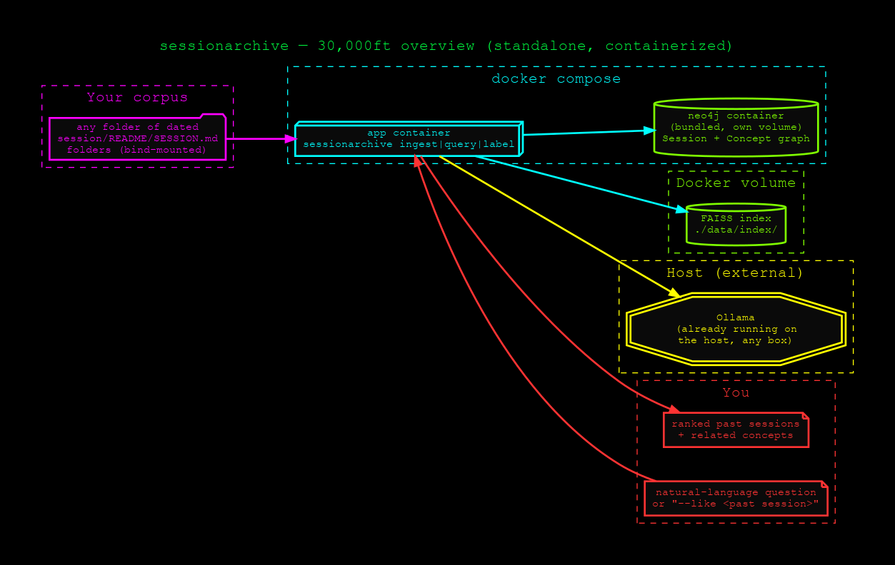
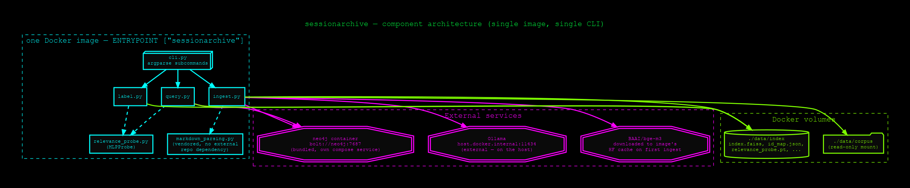

# sessionarchive

<p align="center">
  <a href="https://python.org"></a>
  <a href="https://docs.docker.com/compose/"></a>
  <a href="https://neo4j.com"></a>
  <a href="https://github.com/facebookresearch/faiss"></a>
  <a href="https://huggingface.co/BAAI/bge-m3"></a>
  <a href="https://ollama.com"></a>
  <a href="https://opensource.org/licenses/MIT"></a>
</p>

Semantic search + a knowledge graph over any folder of dated session logs
(engineering journals, incident write-ups, `SESSION.md`/`README.md` files) —
standalone, containerized, one CLI.



## What it does

- **`sessionarchive ingest`** — reads a folder of dated session folders,
  summarizes each with a local Ollama model, chunks + embeds the full text
  with `BAAI/bge-m3`, and writes `Session`/`Concept` nodes into a bundled
  Neo4j graph plus a FAISS vector index.
- **`sessionarchive query "<question>"`** — semantic search over the index,
  with related-`Concept` context pulled from the graph.
- **`sessionarchive query --like <slug>`** — "more like this": finds sessions
  similar to an existing one's own content, not just by shared concepts.
- **`sessionarchive query "<question>" --rerank`** — re-ranks results using a
  relevance probe trained interactively (see below).
- **`sessionarchive label`** — interactive relevance-labeling loop
  (`y`/`n`/`s`/`t`/`q`) that trains a small MLP probe on what you mark useful.

## Quickstart

```bash
git clone https://github.com/danindiana/sessionarchive.git
cd sessionarchive

# put your corpus at ./data/corpus/, then:
docker compose up -d neo4j
docker compose run --rm app ingest --limit 5
docker compose run --rm app query "<a question about one of those 5>"
```

See [`HOWTO.md`](HOWTO.md) for the full cold-start walkthrough and
[`diagrams/start_up_howto.png`](diagrams/start_up_howto.png) for the visual
version.

## Architecture



One Docker image, one CLI with three subcommands. Two external dependencies,
neither containerized here:
- **Neo4j** is bundled in `docker-compose.yml` (own volume, fully standalone)
- **Ollama** stays on the host — it's commonly a shared, multi-model resource
  already running for other things; reached via `OLLAMA_URL`

On Linux, the `app` service uses `network_mode: host` — this matters because
Ollama is frequently bound to `127.0.0.1` only (a common, deliberate security
default), which a bridge network's `host.docker.internal` **cannot** reach.
See [`diagrams/catch22s.png`](diagrams/catch22s.png) for this and other real
gotchas hit building this. Mac/Windows users: switch the `app` service to
bridge networking + `extra_hosts: host.docker.internal:host-gateway`, and
point `OLLAMA_URL` there instead — host networking is Linux-only.

## Design note: the relevance probe

`sessionarchive label` trains a small MLP (`Linear(1024→128)→ReLU→Dropout→Linear(128→1)`)
on `bge-m3` chunk vectors — ported from a sibling project, `militia-classifier`,
whose probe is trained against one fixed target class ("is this militia-like
or not"). This tool has no single fixed target — every query is different —
so the probe learns a general, corpus-wide relevance/quality signal
accumulated across whatever you've labeled so far, not true per-query
relevance. `--rerank` boosts chunks that look like the kind of thing you've
previously marked useful, rather than what's specifically relevant to today's
question. See [`diagrams/future_directions.png`](diagrams/future_directions.png)
for a lighter-weight per-query alternative under consideration (Rocchio-style
ephemeral feedback, no persisted model).

## Diagrams

| Diagram | Covers |
|---|---|
| [`overview`](diagrams/overview.png) | 30,000-ft mental model |
| [`system_architecture`](diagrams/system_architecture.png) | Single image, single CLI, what talks to what |
| [`start_up_howto`](diagrams/start_up_howto.png) | Flowchart companion to `HOWTO.md` |
| [`portability`](diagrams/portability.png) | What's portable out of the box vs. Linux-specific |
| [`catch22s`](diagrams/catch22s.png) | Real gotchas hit containerizing this (loopback Ollama, torch segfault, port collisions) |
| [`future_directions`](diagrams/future_directions.png) | Shipped vs. proposed roadmap |
| [`network_topology`](diagrams/network_topology.png) | All localhost/outbound, zero WAN exposure |
| [`lib_depends`](diagrams/lib_depends.png) | Library dependency tree |
| [`data_model`](diagrams/data_model.png) | Neo4j schema + FAISS index layout, side by side |
| [`cli_reference`](diagrams/cli_reference.png) | All three subcommands and their exact flags |
| [`before_after`](diagrams/before_after.png) | The actual migration: embedded-in-paper_processor vs. standalone |

## Testing

[`tests/test_label_interactive.py`](tests/test_label_interactive.py) verifies
`label`'s raw single-keypress TTY interaction end to end — the one piece that
can't be tested by piping bytes into stdin, since `termios.tcgetattr`/
`tty.setraw()` require a real tty device. It allocates a real pseudo-terminal
(Python's `pty` module) and drives `docker compose run --rm -it app label`
through it exactly as a human typing would: ingests a small synthetic
fixture corpus ([`tests/fixtures/corpus/`](tests/fixtures/corpus/)), labels
two chunks, forces a retrain, quits, and asserts the results (labels,
trained probe) actually persisted correctly. Requires the stack already up:

```bash
docker compose up -d neo4j    # + ollama serve running, with a model pulled
python3 tests/test_label_interactive.py
```

## History

Started as `session_archive/` inside
[`lobster-graph`](https://github.com/danindiana/lobster-graph) (the
`paper_processor` pipeline), sharing that project's Neo4j graph so a
session's concepts cross-linked automatically with AI/ML paper concepts.
Extracted here as a standalone, containerized tool — trading that automatic
cross-linking for a project that clones, builds, and runs anywhere Docker
does, independent of any other repo.

## Related subproject: CosmosGL dashboard

[`cosmosgl-dashboard/`](cosmosgl-dashboard/) is a from-scratch, fully
containerized rebuild of the CosmosGL (`@cosmos.gl/graph`) WebGL graph
viewer that also lives in `paper_processor/neo4j_viz/` — reconstructed here
with a reproducible JS build (the original's bundle had no source committed),
Docker images for both the HTTP/API backend and the GPU ForceAtlas2 layout
step, and a pytest suite covering the API and the running container. It
bundles its own Neo4j and is otherwise unrelated to the semantic-search code
above them; see [`cosmosgl-dashboard/README.md`](cosmosgl-dashboard/README.md).

## License

MIT
