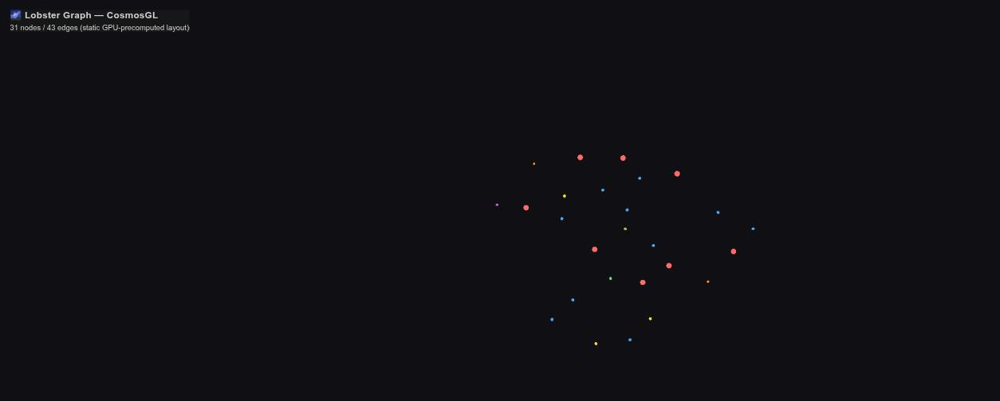
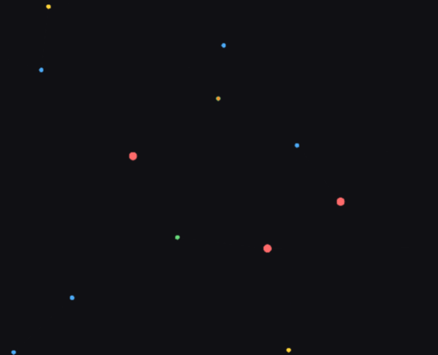

# cosmosgl-dashboard

<p align="center">
  <a href="https://docs.docker.com/compose/"></a>
  <a href="https://neo4j.com"></a>
  <a href="https://cosmos.gl"></a>
  <a href="https://python.org"></a>
  <a href="https://esbuild.github.io"></a>
  <a href="https://rapids.ai"></a>
  <a href="https://opensource.org/licenses/MIT"></a>
</p>

A standalone, containerized rebuild of the [CosmosGL](https://cosmos.gl) (`@cosmos.gl/graph`)
WebGL graph viewer — a GPU-rendered dashboard over a Neo4j graph, with a Python HTTP/API
backend and a GPU-accelerated layout precompute step.

## Screenshots

A 31-node / 43-edge demo graph (papers, concepts, theorems, algorithms, code snippets, and
diagrams), laid out by the real GPU `layout` service and rendered by the actual running dashboard:

| | |
|---|---|
|  |  |
| Full view — legend bottom-left, node/edge count top-left | Close-up — node color/size encodes type (red `Paper`, blue `Concept`, yellow `Theorem`, green `Algorithm`, purple `CodeSnippet`, orange `Diagram`) |

## Relationship to `paper_processor`

This started life as `paper_processor/neo4j_viz/cosmos_server.py` +
`cosmos_dashboard.html` (the "Lobster Graph — CosmosGL Dashboard", port 8686 in that
project). That version has no Dockerfile for the dashboard itself (only its Neo4j is
containerized), and its JS bundle (`cosmos_bundle.js`) was committed pre-built with no
source ever checked in — only `node_modules/` and a lockfile survive.

Everything here is a fresh, self-contained build of the same behavior:
- The Python backend and cuGraph layout script are containerized, not bare-metal.
- The frontend glue code (`frontend/src/app.js`) is reconstructed as readable source,
  restoring real names from the decompiled bundle, and is built from source inside the
  Docker image via esbuild — no prebuilt JS artifact is shipped or committed.
- It bundles its own Neo4j instance, independent of `paper_processor`'s. It does not read
  from or write to that project's live database, and nothing in `paper_processor` was
  modified to build this.

## What it does

- **`server`** — `cosmos_server.py` serves the dashboard's static assets and three JSON/
  binary endpoints backed by Neo4j:
  - `GET /api/graph` — all nodes (id, type, label, `fx`/`fy` layout coordinates) and edges
  - `GET /api/node/<id>` — a single node's full properties, for the detail modal
  - `GET /pdf/<id>` — streams a `Paper` node's source PDF, if it exists on disk
- **`layout`** — `compute_layout.py`, a one-shot GPU job: pulls the graph topology from
  Neo4j, runs cuGraph's `force_atlas2` on the GPU, and writes the resulting `(x, y)` back
  onto each node as `fx`/`fy`. The frontend then renders a **static** layout
  (`enableSimulation: false`) instead of simulating in the browser.
- **`frontend`** — the CosmosGL-based viewer itself: color/size-coded nodes by type
  (`Paper`, `Concept`, `Theorem`, `Algorithm`, `CodeSnippet`, `Diagram`), hover tooltips,
  and a double-click-to-open detail modal (with a source-PDF link for `Paper` nodes).

## Quickstart

```bash
cd cosmosgl-dashboard
docker compose up -d --build neo4j server
```

Then open `http://localhost:28686` (or whatever `DASHBOARD_PORT` is set to in `.env`).
The dashboard will show an empty graph until you load data into the bundled Neo4j — point
any Cypher client at `bolt://localhost:27687` (`neo4j`/`password123`, both overridable via
`.env`) and load nodes labeled `Paper`/`Concept`/`Theorem`/`Algorithm`/`CodeSnippet`/
`Diagram`.

### Running the GPU layout step

```bash
docker compose run --rm layout
```

Requires the [NVIDIA Container Toolkit](https://docs.nvidia.com/datacenter/cloud-native/container-toolkit/latest/install-guide.html)
on the host, **with a CDI spec regenerated against the currently installed driver**
(`sudo nvidia-ctk cdi generate --output=/etc/cdi/nvidia.yaml`) — a stale spec (e.g. left over from
before a driver upgrade) will reference library paths that no longer exist and fail at container
start. `docker-compose.yml`'s GPU reservation uses the CDI device syntax (`devices:
["nvidia.com/gpu=0"]`), not the legacy `deploy.resources.reservations.devices: driver: nvidia`
form, since that requires a registered `nvidia` Docker runtime this doesn't assume you have.

Re-run this any time the graph topology changes and you want node positions recomputed — it's a
one-shot job, not a daemon. Verify it worked by checking that nodes in the bundled Neo4j now have
non-null `fx`/`fy` properties (e.g. via the Neo4j Browser at `http://localhost:27474`), and that
the dashboard renders them at those positions instead of all stacked at the origin.

## Testing

```bash
pip install -r requirements-test.txt
pytest tests/test_cosmos_server_unit.py -v   # fast, no Docker/GPU required
pytest tests/test_container_smoke.py -v      # builds + runs the real stack, seeds data, hits the live API
```

The smoke test suite builds the `server` image, starts it alongside a fresh bundled
Neo4j, seeds a small known graph (`tests/fixtures/seed.cypher`), and verifies `/`,
`/api/graph`, `/api/node/<id>` (both found and 404 cases), and `/pdf/<id>` (404-with-
explanation when the stored path doesn't exist on disk) against the real running
container — then tears the stack down. It does not require a GPU and excludes the
`layout` service; verify that one manually as described above.

## Troubleshooting

Two real problems were hit (and fixed) getting the GPU `layout` service running on real hardware
— both firsthand, not speculative:

- **`Error response from daemon: could not select device driver "nvidia" with capabilities:
  [[gpu]]`** — your host has CDI-based GPU passthrough (the modern NVIDIA Container Toolkit
  default) rather than the legacy `nvidia` Docker runtime. `docker-compose.yml` already uses the
  CDI form (`devices: ["nvidia.com/gpu=0"]`); if you still hit this, check
  `docker info | grep -i runtime` for a registered `nvidia` runtime vs. `docker info | grep cdi`
  for CDI devices, and match whichever your host actually has.
- **`Caught signal 11 (Segmentation fault)` inside `cugraph.force_atlas2()`**, deep in
  `libucs.so`/`cuCtxGetDevice_v2` — a RAPIDS-version-vs-driver ABI mismatch. Hit with
  `rapidsai/base:24.12-cuda12.5-py3.11` against a driver/CUDA-13.0-generation host; restricting to
  one GPU and setting `UCX_TLS=tcp` did **not** fix it. Bumping the base image to
  `rapidsai/base:25.10-cuda12.9-py3.11` did. If you hit this on a different host, check
  `nvidia-smi` for your driver/CUDA version and try a `rapidsai/base` tag built against a closer
  CUDA version (`docker manifest inspect rapidsai/base:<tag>` to check a tag exists before pulling).

## Diagrams

| Diagram | Covers |
|---|---|
| [`system_architecture`](diagrams/system_architecture.png) | The three compose services, the frontend build pipeline, ports, and volumes |
| [`integrations_dependencies`](diagrams/integrations_dependencies.png) | Every external dependency — npm, pip, RAPIDS, Docker base images |
| [`dependency_ascii_tree`](diagrams/dependency_ascii_tree.png) | The `@cosmos.gl/graph` npm dependency tree, ASCII-tree style |
| [`catch22s`](diagrams/catch22s.png) | Five real problems hit building this and how each was fixed |
| [`future_directions`](diagrams/future_directions.png) | Shipped vs. proposed-next vs. proposed-later roadmap |
| [`GPU_nvidia_specs`](diagrams/GPU_nvidia_specs.png) | The GPU layout pipeline: hardware, toolkit, compose GPU reservation, `force_atlas2` params |
| [`testing_validation`](diagrams/testing_validation.png) | The full test flow — unit → container smoke → manual GPU check — 9/9 passing |
| [`containerization`](diagrams/containerization.png) | Both Dockerfiles stage-by-stage, plus the compose service definitions |
| [`portability`](diagrams/portability.png) | What's portable out of the box vs. GPU-locked vs. platform-specific |
| [`lay_explain`](diagrams/lay_explain.png) | What this is, explained without jargon |

## License

MIT (same as the parent [`sessionarchive`](../README.md) project).
